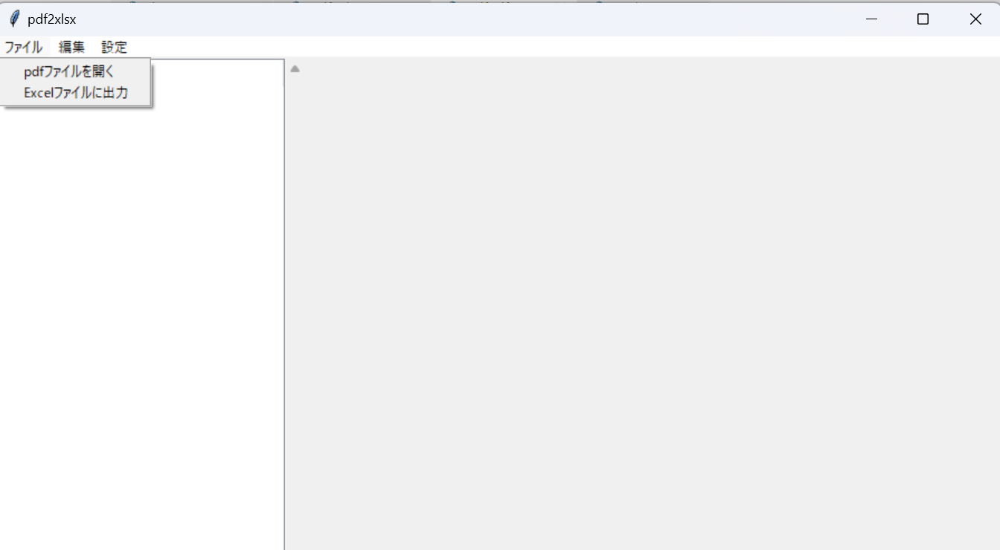
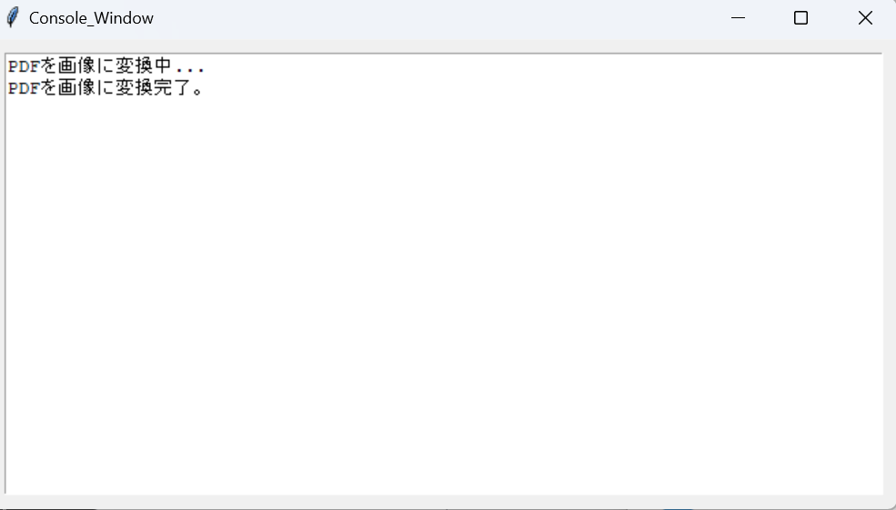
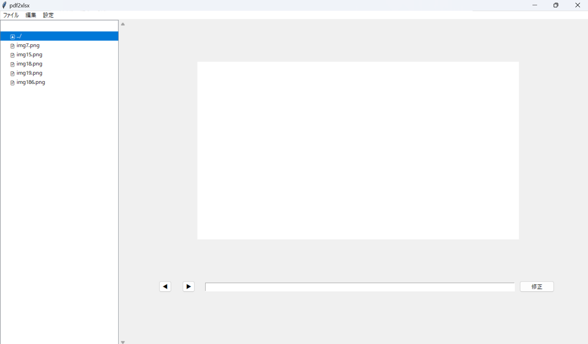
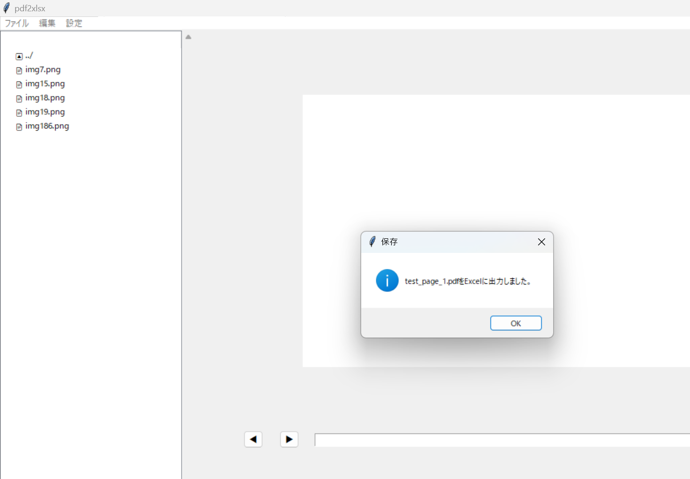
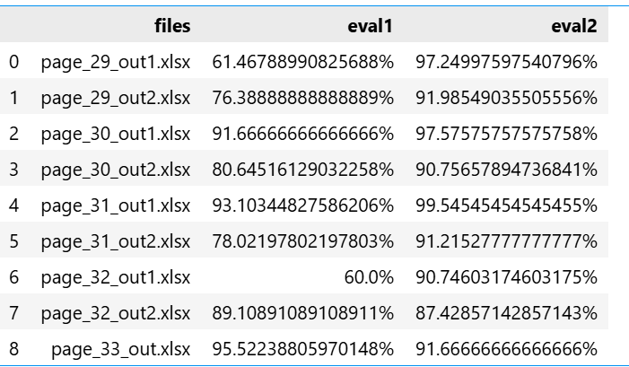

# OCR GUI Application with PaddleOCR ～pdf2xlsx～

## プロジェクト概要
このアプリケーションは、セル形式のPDFファイルからテキストを抽出し、結果をExcelにまとめるGUIツールです。  
業務でのOCR処理をより直感的に行えるように設計しました。  

本プロジェクトは現在も進行中で、最新版ではGUIをC#で、それ以外の処理をPythonで実装しています。  
ただし最新版を公開することはできないため、このリポジトリではGUI部分をC#に移植する前の **tkinter** 実装版を公開しています。あらかじめご了承ください。  

## 技術スタック
- **言語**: Python  
- **GUI**: tkinter  
- **OCRエンジン**: PaddleOCR  
- **処理環境**: 外部GPUサーバー（HTTPS経由で接続）  
- **出力**: Excel (pandas, openpyxl)  

## 大まかな処理の流れ
1. GUIからPDFファイルを選択し、処理を開始  
2. 選択したファイルを前処理したうえで、企業のオンプレGPUサーバーにHTTPS接続し、OCR処理をGPUマシン上で実行  
3. 抽出結果をJSON形式でクライアントに返却し、誤認識の可能性がある文字列をGUI上で手動修正可能  
4. 編集が完了したらExcelへ出力し、一連の処理が完了

## 各ファイルについて
- **pdf2xlsx.py**: メインスクリプト。tkinterによるGUI部分を実装  
- **pdf2df.py**: 内部処理を担当。GPUマシンでの処理用の前処理や、返却されたJSONの正規化を実装  
- **tools.py**: PDFを画像に変換するなど、OCR処理に直接関わらないヘルパー関数をまとめたスクリプト  
- **normalization.py**: pdf2df.pyでデータフレーム化した構造に対し、文字列の正規化を実施  
- **evaluation.py**: OCR精度を評価するスクリプト。PaddleOCRがどの程度正確に文字列を抽出できるかを検証  

`evaluation.py` はプレゼンや第三者への説明用に作成したもので、アプリの挙動には直接影響しません。  
2種類の評価関数を用意しており、以下の画像はその結果を示しています。  
- eval1: 文字列単位で正誤を判定  
- eval2: 文字単位で正誤を判定  

## 外部マシンについて
企業様にご用意いただいたオンプレGPUマシンを、PythonのFastAPIを用いてAPIサーバー化し、アプリケーションとHTTPS通信で連携しています。  

GPUマシンにはDocker Engineを導入し、FastAPI・nginx・PaddleOCRをDocker Composeで構成することでAPIサーバーを実現しました。  
通信は基本的に社内ネットワーク内に限定されているため、現在は簡易的にnginx内でOpenSSLによる自己署名証明書を利用しています。  
今後は企業様にドメインを取得いただき、Let's EncryptによるSSL証明書を導入することで、よりセキュアな構成を検討中です。  

## 今後の展望
- PaddleOCRの調査を進め、OCR精度をさらに改善  
- 企業様向けのポータルサイトをGo + TypeScriptで開発し、アプリケーションをそこから配布できる仕組みを構築  
- GPUマシンをWebサーバー兼APIサーバーとして再構築し、ポータルサイトと統合  
- GUIの修正処理部分を刷新し、より直感的な操作性を実現  
